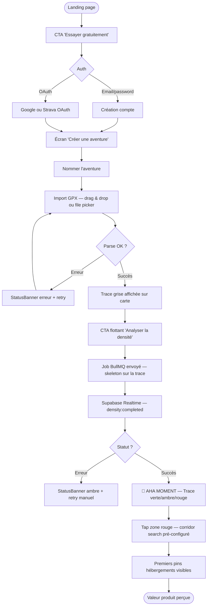
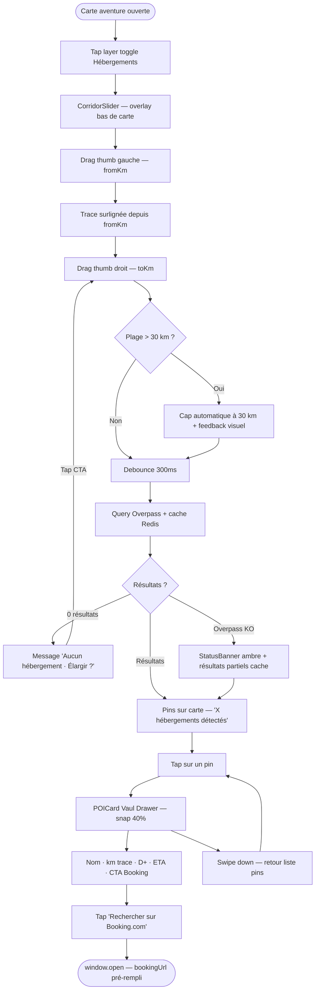
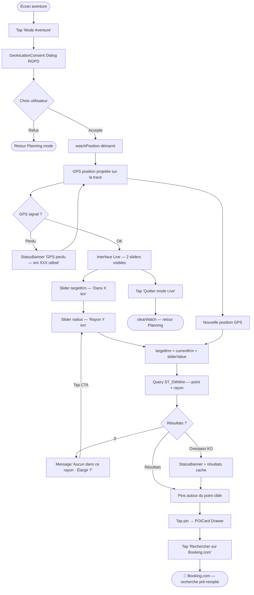
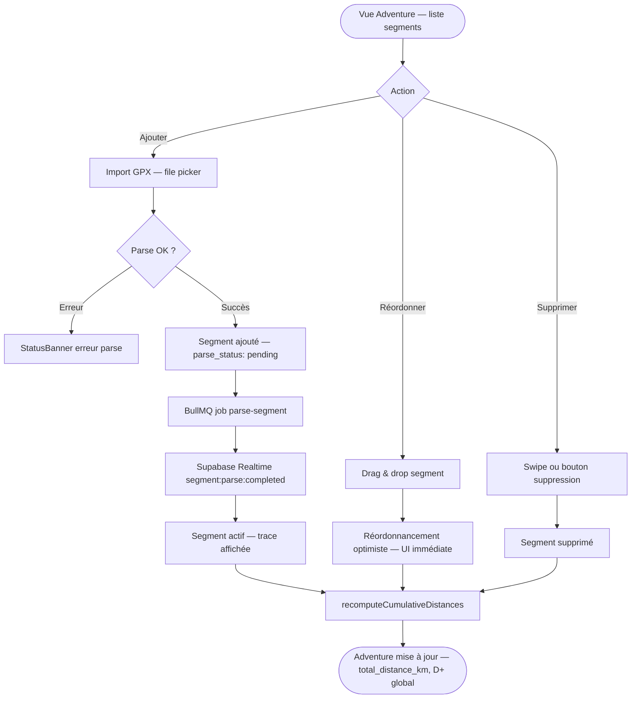

# UX Design Specification ridenrest-app

**Author:** Guillaume
**Date:** 2026-03-02

---

<!-- UX design content will be appended sequentially through collaborative workflow steps -->

## Executive Summary

### Project Vision

Ride'n'Rest est une PWA mobile-first qui résout le context-switch entre Komoot (navigation GPX) et Booking.com (hébergement) pour les cyclistes longue distance. La valeur unique : recherche d'hébergements le long d'un **corridor géospatial GPX** (pas autour d'un point), avec visualisation de la densité directement sur la trace. Le produit cible l'événement Transcantabrique Espagne en avril 2026 comme validation beta avec 16 coureurs ultra.

Deux modes distincts d'utilisation définissent l'expérience : **Planning** (à la maison, préparation sereine d'un voyage multi-jours) et **Live/Aventure** (sur le vélo, en mouvement, conditions dégradées). Ces deux contextes ont des exigences UX quasi-opposées et structurent l'ensemble des décisions de design.

### Target Users

**Thomas — Coureur Ultra (usage on-bike)**
38 ans, ingénieur, participe à des épreuves d'ultra-distance (700 km). Usage en mobilité : épuisé, une main disponible, connexion instable (3G rural), soleil direct sur l'écran. Besoin d'une réponse en < 3 minutes. Zéro tolérance pour l'UX complexe ou les menus profonds. Le temps de chargement et la lisibilité sous soleil sont ses critères premiers.

**Sophie — Bikepacker Autonome (usage planning)**
Planifie des voyages multi-étapes depuis chez elle. Importe 4 GPX, réordonne les segments, explore les calques POI (hébergements, restauration, alimentation). Prend le temps de comparer, modifie son plan itérativement. Usage desktop ou mobile en conditions confortables. Apprécie la richesse d'information et la lisibilité de la carte colorisée.

**Marc — Nouvel Utilisateur (onboarding)**
Découvre le produit via la communauté bikepacking. L'onboarding doit livrer la valeur produit en < 5 minutes sans tutoriel. La carte qui se colorise est son aha-moment — il comprend le produit en 30 secondes par l'image, pas par le texte.

### Key Design Challenges

**1. Interface duale Planning / Live**
Le même produit sert deux états émotionnels et physiques opposés. L'interface Planning peut être riche en fonctionnalités ; l'interface Live doit être brutalement simple — grands éléments tactiles (≥ 48px), contraste extrême, 0 menu profond, feedback immédiat. Le passage d'un mode à l'autre doit être explicite et sans friction.

**2. Carte comme canvas principal sur mobile**
Corridor search slider, calques POI toggleables, zoom/pan MapLibre, fiche POI en bottom sheet, sliders distance/rayon en mode Live — tout cela sur 390px de largeur. La hiérarchie des contrôles sur la carte est critique. Les overlays doivent être minimaux et rétractables.

**3. Dégradation gracieuse omniprésente**
Connexion 3G instable, offline partiel, GPS perdu, Overpass API indisponible — l'UI doit toujours afficher quelque chose d'utile. Les `<StatusBanner />` et états d'erreur partiels sont de la UX au même titre que les happy paths. Aucun état vide non expliqué.

**4. Onboarding auto-explicatif sans tutoriel**
La trace colorisée (vert/orange/rouge) doit être immédiatement lisible sans explication. La légende densité est discoverable (icône accessible) mais non imposée. L'onboarding se fait par la valeur visuelle immédiate, pas par des écrans d'instruction.

### Design Opportunities

**1. Dark mode comme identité visuelle**
L'usage nocturne sur route est central au persona. Une interface sombre avec trace colorisée vert/orange/rouge crée une identité visuelle forte et distinctive — pas un simple thème alternatif mais l'expérience principale. Le dark mode est le default.

**2. Mode Live comme design à part entière**
L'interface Live mérite une conception autonome : épurée, quasi-monochrome, centrée sur 2 sliders (distance cible + rayon) et une liste POI claire. C'est presque une micro-app dans l'app, avec sa propre logique d'entrée (consentement géoloc) et de sortie (clearWatch automatique).

**3. La trace comme langage visuel unique**
La colorisation de la trace GPX est un nouveau langage pour les cyclistes — aucun concurrent ne l'utilise. Le design doit l'amplifier : animation de transition au chargement des couleurs, tap sur une zone rouge → corridor search automatique pré-configuré. La trace parle avant même que l'utilisateur interagisse.

**4. Composants ciblés haute valeur**
`<POICard>` (nom + distance trace + D+ + ETA + booking links), `<StatusBanner>` (offline/connexion instable), `<DensityLegend>` (légende discoverable), `<GeolocationConsent>` (RGPD explicite) — des composants bien conçus qui font 80% du travail UX perçu.

---

## Core User Experience

### Defining Experience

L'action fondamentale de Ride'n'Rest : **"Trouver où dormir ce soir sur mon parcours — en moins de 3 minutes."**

En Planning mode : définir une plage km → voir les hébergements dans le corridor géospatial.
En Live mode : positionner le slider à X km → voir immédiatement les options à ce point d'arrêt précis.

L'interaction make-or-break est le **premier résultat POI visible** — si les pins n'apparaissent pas vite et clairement, le produit a échoué son test de valeur. Tout le design converge vers ce moment.

### Platform Strategy

- **PWA mobile-first** — iOS Safari 16+, Chrome Android 110+, installable sur l'écran d'accueil
- **Touch-based** en priorité — touches minimum 48×48px, 0 interaction hover-only
- **Offline partiel** — dernière trace + POIs consultables sans réseau via Service Worker
- **GPS natif** (`watchPosition`) — uniquement en Live mode, avec consentement explicite RGPD
- **Desktop = contexte secondaire** — Planning uniquement, même interface responsive (pas d'UI dédiée desktop)
- **Dark mode = expérience par défaut** — usage nocturne et outdoor, identité visuelle principale

### Effortless Interactions

**Trace colorisée — zero effort d'interprétation**
Upload GPX → parse → carte affichée → "Analyser" → trace vert/orange/rouge. L'animation de transition doit être fluide et immédiatement lisible. La signification des couleurs est évidente sans légende.

**Passage en mode Live — 3 étapes maximum**
1 tap "Mode Aventure" → 1 consentement géoloc → 2 sliders visibles → premier résultat < 2s. Aucun formulaire, aucun écran intermédiaire, aucune configuration préalable requise.

**Booking en 2 taps**
Tap sur pin → bottom sheet POI → tap "Hotels.com" → page de réservation pré-remplie. Le cycliste épuisé ne tape rien — le nom du POI et les coordonnées sont passés en paramètre du deep link.

**Réordonnancement de segments**
Drag-and-drop fluide, distances cumulatives et D+ mis à jour en temps réel. Feedback visuel immédiat sans état intermédiaire de chargement.

### Critical Success Moments

| Moment | Critère de réussite |
|---|---|
| **Aha moment** | Trace colorisée → rouge visible → utilisateur comprend la zone critique en < 5 secondes sans aide |
| **Live activation** | GPS actif + premier pin hébergement affiché en < 2s après consentement |
| **Booking redirect** | Hotels.com s'ouvre avec la recherche pré-remplie — aucune saisie requise |
| **Offline fallback** | Perte réseau → trace + derniers POIs toujours visibles + StatusBanner clair |
| **Onboarding** | Valeur produit perçue en < 5 min, compte créé, premier GPX affiché — sans tutoriel |

### Experience Principles

**1. La carte EST le produit**
La carte MapLibre est le canvas central, pas un composant parmi d'autres. Tout le reste (sliders, fiches POI, toggles calques) est un overlay minimalement invasif. La carte reste toujours visible et navigable — aucun modal ne la masque complètement.

**2. Deux modes, deux designs**
Planning : riche, exploratoire, calme — interface complète avec tous les contrôles visibles. Live : épuré, binaire, immédiat — 2 sliders, liste POI, rien d'autre. Le passage entre les deux est une transition explicite, pas un glissement imperceptible.

**3. Confiance progressive**
Les utilisateurs voient de la valeur avant de s'engager : trace affichée avant analyse, résultats partiels avant résultats complets, preview de carte avant login. Jamais d'écran vide ni d'attente aveugle sans feedback.

**4. Momentum gracieux**
Rien n'arrête l'utilisateur. Overpass KO → résultats partiels + retry visible. GPS perdu → dernière position + banner. Connexion instable → résultats déjà chargés restent affichés. Le produit avance avec l'utilisateur même quand les conditions dégradent.

---

## Desired Emotional Response

### Primary Emotional Goals

**1. Soulagement géographique — "Je sais dans quelle zone m'arrêter ce soir"** *(Thomas, mode Live)*
L'app résout la question *où*, pas la question *comment réserver*. Thomas n'a pas besoin de l'exhaustivité des chambres disponibles — il a besoin de savoir qu'il y a *quelque chose à X km sur son parcours*. Booking.com s'occupe du reste. Le soulagement vient de la certitude géographique, pas de l'inventaire complet.

**2. Maîtrise sereine — "Mon aventure est planifiée, les zones critiques sont identifiées"** *(Sophie, mode Planning)*
La trace colorisée révèle les zones denses et les zones creuses. Sophie sait *où elle aura l'embarras du choix* (vert) et *où elle doit réserver à l'avance* (rouge). La richesse de l'inventaire Booking n'est pas son problème — la structure géographique de son itinéraire l'est.

**3. Émerveillement — "Ce produit pense en cycliste"** *(Marc, onboarding)*
La trace colorisée crée l'aha moment. Mais la compréhension qui suit — "l'app sait que je ne cherche pas un hôtel à Paris, je cherche un hôtel *sur mon parcours entre le km 180 et le km 210*" — est ce qui différencie Ride'n'Rest de toute autre recherche d'hébergement.

---

### Emotional Journey Mapping

| Moment | Émotion cible | Émotion à éviter |
|---|---|---|
| **Découverte** | Curiosité → "une carte qui pense en itinéraire" | Scepticisme ("encore une appli carte") |
| **Premier GPX + colorisation** | Émerveillement → zones critiques visibles en 5s | Confusion (que signifient ces couleurs ?) |
| **Premiers pins hébergements** | Confiance → "il y en a sur mon parcours" | Déception ("seulement 3 résultats ?") |
| **CTA Booking.com** | Soulagement → "je suis à 2 taps de réserver" | Friction (je dois refaire la recherche sur Booking) |
| **Retour sur Booking.com** | Accomplissement → Booking est pré-filtré sur la bonne zone | Perte de contexte ("où étais-je dans mon parcours ?") |
| **Perte de réseau** | Sécurité → trace + POIs déjà chargés restent visibles | Panique ("j'ai perdu mes données") |
| **Retour d'usage** | Maîtrise → l'app est devenue un réflexe de planning | Indifférence |

---

### Micro-Emotions

**Confiance calibrée vs sur-promesse**
Les résultats OSM/Google Places sont indicatifs — il y a quasi-toujours plus d'options sur Booking.com. Le design doit calibrer les attentes honnêtement, sans jamais créer l'illusion d'exhaustivité. L'étiquette "X hébergements détectés · Plus d'options sur Booking.com" est un acte de transparence qui *renforce* la confiance plutôt qu'une faiblesse à cacher.

**Contrôle vs Confusion**
En mode Live : 2 sliders, résultats immédiats. En mode Planning : trace colorisée comme boussole visuelle. Aucune surcharge informationnelle. L'utilisateur comprend l'état de son aventure en un coup d'œil.

**Sécurité vs Anxiété**
Dégradation gracieuse : offline annoncé, résultats partiels maintenus, `<StatusBanner>` informatif non alarmiste. Le produit ne disparaît jamais.

**Delight → Surprise**
Animation de colorisation, tap sur zone rouge → corridor search pré-configuré, deep link Booking pré-rempli. Micro-moments de "l'app a fait ça pour moi".

**Accomplissement → Le vrai moment de victoire**
Ce n'est pas "voir un pin sur la carte" — c'est "Booking.com s'est ouvert avec ma zone pré-renseignée et je n'ai pas eu à taper une seule lettre". C'est là que l'utilisateur perçoit la valeur différenciante du produit.

---

### Design Implications

**Soulagement géographique → Clarifier le rôle de l'app dans la POICard**
Chaque liste de résultats porte un sous-texte honnête : *"X hébergements détectés sur le parcours · Les disponibilités sont sur Booking.com"*. Le CTA principal est "Rechercher sur Booking.com" — pas "Voir les détails" (qui suggère que l'app contient tout).

**Confiance calibrée → Jamais présenter les résultats comme exhaustifs**
Pas de "Tous les hébergements entre km 150 et km 180". Plutôt "Hébergements détectés dans ce corridor". La nuance linguistique est une décision de design émotionnel — elle aligne les attentes et évite la déception.

**Accomplissement → Le deep link Booking comme feature star**
Le moment "Booking.com s'ouvre avec ma recherche pré-remplie" est le pic émotionnel du produit. Il mérite une attention particulière dans l'animation de transition — feedback visuel qui confirme l'ouverture et le contexte transmis.

**Vitesse → Confiance**
< 2 secondes pour les premiers pins. Skeleton loaders, jamais de spinner global. La rapidité est la preuve que ça fonctionne.

**Sécurité → `<StatusBanner>` proactif**
Annonce la dégradation *avant* que l'utilisateur la remarque. Ton informatif, jamais alarmiste.

---

### Emotional Design Principles

**1. L'app est un filtre géographique, Booking est le catalogue**
Ride'n'Rest résout *où chercher*. Booking résout *quoi réserver*. Le design ne doit jamais créer l'illusion que l'app remplace Booking. Elle le prépare. Cette complémentarité est une force, pas une limitation.

**2. La transparence sur les données crée plus de confiance que la sur-promesse**
Afficher "5 hébergements détectés · Plus sur Booking.com" est plus honnête et plus utile que prétendre à l'exhaustivité. L'utilisateur qui comprend le rôle de l'app lui fait confiance — celui qui se sent trompé ne revient pas.

**3. La sécurité avant le delight**
Le produit est utilisé dans des conditions difficiles. La première priorité émotionnelle est de *ne jamais laisser l'utilisateur sans ressource*. Le delight (animations, surprises) est une couche au-dessus.

**4. La vitesse EST une émotion**
< 2s = confiance. > 5s = doute. Les performances sont des décisions de design émotionnel.

**5. La couleur porte le sens, le texte confirme**
Vert/orange/rouge : compris avant d'être lu. Le design ne peut pas dépendre d'un texte explicatif pour sa compréhension initiale.

**6. Le momentum ne s'arrête jamais**
Overpass KO → résultats partiels + retry. GPS perdu → dernière position maintenue. Pas de modal bloquant. Le produit roule avec le cycliste.

---

## UX Pattern Analysis & Inspiration

### Inspiring Products Analysis

**1. Komoot — La référence des cyclistes**
Komoot est l'app que Thomas et Sophie utilisent déjà quotidiennement. Ses forces UX : la navigation par trace GPX comme objet central, les POI découvrables *le long* du parcours (restaurants, curiosités), les cartes offline intégrées, et une identité visuelle outdoor forte. Sa faiblesse est précisément la niche de Ride'n'Rest : *zéro* recherche d'hébergement, *zéro* analyse de densité. Les cyclistes connaissent et font confiance à l'UX Komoot — Ride'n'Rest doit s'inscrire dans ce vocabulaire visuel, pas le contredire.

**2. AllTrails — Le corridor search de l'outdoor**
AllTrails a résolu un problème similaire pour la randonnée : rechercher des trails *dans une zone géographique* avec visualisation de la difficulté sur le parcours (analogie directe avec notre densité hébergements). Leur onboarding sans tutoriel, leur offline-first mindset, et leur filtrage par critères visibles en permanence (pas dans un menu profond) sont des patterns de référence. La carte est leur canvas principal.

**3. Waze — Le mode Live de conduite**
Waze est le meilleur exemple de *simplified driving-mode UX* : pendant la navigation, l'interface se réduit à l'essentiel, les alertes apparaissent en banners non bloquants, les touches sont maximisées. La philosophie "0 menu pendant le mouvement" est directement applicable à notre mode Live. Waze switche automatiquement en dark mode la nuit — un comportement que Ride'n'Rest doit envisager pour le mode Live.

**4. Airbnb (app mobile) — La carte comme outil de recherche**
Airbnb a inversé le paradigme booking : la carte n'est pas une vue secondaire — c'est l'interface principale de recherche. Les pins affichent le prix directement sur la carte, la bottom sheet de détail est leur pattern canonique pour les POI, le CTA de réservation est toujours visible sans scroll. Leur "Rechercher dans cette zone" pendant le pan de carte est l'inspiration directe de notre corridor search slider.

**5. Strava — La trace colorisée comme identité**
Strava colorise les segments (rouge = KOM, violet = PR, orange = effort personnel) — les cyclistes comprennent instinctivement qu'une couleur sur une trace signifie quelque chose d'important. Ride'n'Rest peut s'appuyer sur ce vocabulaire établi : vert/orange/rouge sur une trace est *déjà* un langage connu de notre cible. Strava est aussi la référence du dark mode outdoor — leur interface nocturne est devenue une identité.

---

### Transferable UX Patterns

**Navigation Patterns :**
- **Komoot — POI card distance-along-route** : chaque point d'intérêt affiche sa distance *le long* du parcours, pas à vol d'oiseau. Ride'n'Rest adopte exactement ce pattern pour `<POICard>` : "km 187 sur votre trace", pas "3.2 km de vous".
- **AllTrails — Persistent filter bar** : les filtres principaux sont toujours visibles en haut de l'écran, jamais cachés dans un menu. En mode Planning, les toggles calques (hébergements / restauration / vélo) restent visibles sans tap supplémentaire.
- **Airbnb — Bottom sheet as primary POI view** : tap sur un pin → bottom sheet qui monte à mi-écran, la carte reste visible au-dessus. C'est le pattern canonique pour `<POICard>` — jamais un modal plein écran qui cache la carte.

**Interaction Patterns :**
- **Airbnb — "Rechercher dans cette zone"** : le slider de corridor search est notre version de ce pattern. L'utilisateur manipule un paramètre géographique → les résultats se mettent à jour sur la carte en temps réel.
- **Waze — Alert banners non bloquants** : les alertes (accident, radar) apparaissent en banner superposé, disparaissent automatiquement, ne bloquent pas la navigation. Exactement le comportement de notre `<StatusBanner>` : connexion instable → banner amber → disparaît quand la connexion revient.
- **Waze — Simplified live mode** : en mode navigation, Waze cache ses menus et maximise l'espace carte + les infos critiques. Mode Live de Ride'n'Rest : 2 sliders + liste POI + carte. Rien d'autre.
- **Strava — Segment tap** : tap sur un segment colorisé → bottom sheet avec les stats de ce segment. Notre adaptation : tap sur une zone rouge de la trace → corridor search pré-configuré sur cette zone critique.

**Visual Patterns :**
- **Strava — Trace colorisée comme langage** : les cyclistes lisent instinctivement une trace colorée. Ride'n'Rest adopte la même logique mais pour la densité hébergements. Pas besoin de légende imposée — la couleur parle.
- **Komoot — Dark mode outdoor** : interface sombre, couleurs saturées sur fond sombre, typographie haute lisibilité. C'est le vocabulaire visuel de notre cible. Dark mode comme identité, pas comme option.
- **AllTrails — Difficulty badge on trail** : badge discret sur chaque trail card indiquant la difficulté (vert/orange/rouge). Pattern applicable au badge de densité sur chaque zone de la trace.

---

### Anti-Patterns to Avoid

**Google Maps — Information overload sur carte mobile**
Quand Google Maps est en mode "recherche POI", la carte se couvre de pins de catégories différentes, les filtres sont dans un menu caché, les résultats sont dans une liste qui masque la carte. Sur mobile outdoor, c'est un cauchemar d'usage. Ride'n'Rest : un seul calque actif à la fois, toggles simples et visibles, carte toujours prioritaire.

**Booking.com app — La carte comme vue secondaire**
La carte de Booking.com est accessible via un bouton, n'est pas l'interface principale, et les résultats sont filtrés via un formulaire de 8 champs. C'est le paradigme exact à *ne pas* reproduire. Notre différenciateur est que la carte EST le produit — jamais reléguée à une vue alternative.

**Tutoriels d'onboarding bloquants (modals)**
Apps comme Headspace ou les vieux apps banking imposent 5-7 modals d'explication avant d'accéder au produit. Résultat : 40% d'abandon avant même d'avoir vu la valeur. Ride'n'Rest : la valeur est visible en < 30 secondes (trace colorisée), sans aucune explication imposée.

**Hotel.com / Trivago — Noise visuel promotionnel**
Prix barrés, badges "Best value", "Only 2 rooms left !", promotions en rouge partout. Visuellement anxiogène et difficile à lire sous soleil. Ride'n'Rest n'a pas de pricing direct — les résultats OSM/Google sont présentés proprement (nom, catégorie, distance) avec un seul CTA clair vers Booking.com.

**Applications avec spinner global bloquant**
Apps qui affichent un spinner plein écran pendant le chargement des POI — l'utilisateur ne peut rien faire d'autre. Ride'n'Rest : skeleton loaders localisés sur la liste POI, la carte reste interactive, les résultats partiels s'affichent au fur et à mesure.

---

### Design Inspiration Strategy

**À adopter directement :**
- Bottom sheet pour `<POICard>` (Airbnb) — pattern canonique mobile, préserve la carte visible
- Trace colorisée comme langage visuel (Strava) — vocabulaire déjà connu des cyclistes
- Alert banners non bloquants pour `<StatusBanner>` (Waze) — informatifs, disparaissent automatiquement
- Distance-along-route dans les POI cards (Komoot) — la métrique que les cyclistes comprennent
- Carte comme interface principale de recherche (Airbnb) — pas une vue secondaire

**À adapter :**
- Simplified live mode (Waze → notre mode Live) : les 2 sliders remplacent les contrôles de navigation. Le principe "0 menu profond pendant le mouvement" est identique, le contexte est cyclisme.
- Corridor search (AllTrails "search in area" + Airbnb "search this zone") : notre slider km est plus précis qu'un simple "zone", car il exploite la géométrie du GPX.
- Dark mode comme identité (Strava + Komoot) : pas seulement pour l'outdoor, aussi pour la lisibilité en lumière vive avec contraste inversé.

**À éviter absolument :**
- Information overload sur la carte (Google Maps) — conflit direct avec "la carte EST le produit"
- Formulaires de recherche multi-champs (Booking.com) — 0 saisie manuelle pour Thomas sur le vélo
- Onboarding tutoriel bloquant (anti-pattern généralisé) — la trace colorisée EST le tutoriel

---

## Design System Foundation

### Design System Choice

**shadcn/ui + Tailwind CSS v4** — Themeable system, déjà validé dans l'architecture technique.

shadcn/ui est un ensemble de composants construits sur **Radix UI** (accessibilité, headless) et stylés avec Tailwind. Le modèle "copy-paste" (les composants vivent dans le codebase, pas dans `node_modules`) donne une propriété totale sur chaque composant — critique pour les personnalisations outdoor/dark-mode de Ride'n'Rest. Tailwind CSS v4 fournit les design tokens via CSS custom properties natives.

---

### Rationale for Selection

**Solo dev, deadline avril 2026 — vitesse sans sacrifier la qualité**
shadcn/ui donne immédiatement : Drawer (bottom sheet), Slider, Toggle, Badge, Skeleton — tous les composants clés de Ride'n'Rest. Zéro temps de design sur les composants génériques ; tout l'effort de design sur les composants métier (POICard, trace colorisée, sliders Live mode).

**Dark mode first, natif**
shadcn/ui + Tailwind CSS v4 gèrent le dark/light mode par classe CSS sur `<html>` — aucun hack, aucune lib tierce. Notre dark mode par défaut s'implémente en une ligne de configuration. La palette sombre est customisable token par token.

**Accessibilité Radix UI incluse**
Radix UI (base de shadcn/ui) implémente les patterns ARIA pour chaque composant : Dialog, Slider, Toggle group, DropdownMenu. Sur mobile avec screen reader ou en conditions dégradées, les composants se comportent correctement sans effort supplémentaire.

**Propriété totale des composants**
Le modèle copy-paste signifie que `<POICard>`, `<StatusBanner>`, `<GeolocationConsent>` seront des extensions directes des composants shadcn/ui — même API, même tokens, même dark mode. Pas de conflit de dépendances, pas de breaking changes au prochain update npm.

**Écosystème Vaul pour le bottom sheet**
La drawer/bottom sheet (pattern central pour les POI cards) est fournie par **Vaul** — la lib de bottom sheet recommandée par shadcn/ui, avec snap points, dismiss par swipe, et comportement natif mobile.

---

### Implementation Approach

**Design tokens Tailwind CSS v4 (CSS custom properties)**
```css
/* globals.css — dark mode default */
:root {
  /* Trace density colors */
  --color-density-high: #22c55e;    /* vert — nombreux hébergements */
  --color-density-medium: #f59e0b;  /* ambre — quelques options */
  --color-density-low: #ef4444;     /* rouge — zone critique */

  /* Brand dark palette */
  --color-background: #0f1117;
  --color-surface: #1a1d27;
  --color-surface-elevated: #232736;

  /* Status colors */
  --color-status-warning: #f59e0b;
  --color-status-offline: #6b7280;
}
```

**Mode dark par défaut, light optionnel**
```tsx
// layout.tsx
<html lang="fr" className="dark">
```

**Composants shadcn/ui utilisés directement :**
- `Drawer` (Vaul) → `<POICard>` bottom sheet
- `Slider` → corridor search slider (Planning) + distance/rayon sliders (Live)
- `Toggle` / `ToggleGroup` → calques carte (hébergements / restauration / alimentation / vélo)
- `Badge` → catégorie POI, densité indicator
- `Skeleton` → états de chargement POI list et carte
- `Alert` → base de `<StatusBanner>`
- `Dialog` → `<GeolocationConsent>` (RGPD, modal bloquant intentionnel unique)

---

### Customization Strategy

**Composants métier custom (extensions shadcn/ui)**

`<POICard>` — bottom sheet avec Vaul :
- Nom + catégorie (Badge), distance le long de la trace + D+ + ETA
- CTA "Rechercher sur Booking.com" (bouton primary)
- Sous-texte : "X hébergements détectés · Plus d'options sur Booking.com"

`<StatusBanner>` — extension de Alert :
- Variantes : `offline` (gris), `unstable` (ambre), `gps-lost` (ambre), `api-error` (ambre)
- Auto-dismiss configurable, position fixed top, z-index au-dessus de la carte

`<DensityLegend>` — composant custom discoverable :
- Icône flottante sur la carte (bottom-right), tap → popover vert/ambre/rouge
- Non imposé, jamais affiché automatiquement

`<GeolocationConsent>` — Dialog Radix UI :
- Seul modal bloquant justifié (RGPD)
- Texte explicite : "Votre position reste sur votre appareil, jamais envoyée à nos serveurs"

`<CorridorSlider>` — extension Slider shadcn/ui :
- Double thumb (fromKm / toKm) pour Planning, single thumb (targetKm) pour Live
- Labels km affichés en temps réel, plage max 30 km en Planning

**MapLibre overlays — composants purement custom**
Contrôles sur carte (zoom, attribution OSM, layer toggles flottants) : divs positionnés en absolute sur le canvas MapLibre, respectent les tokens Tailwind mais indépendants de Radix UI.

---

## Defining Experience

### 2.1 The Defining Interaction

**Pour Ride'n'Rest :** *"Glisser pour voir où dormir sur ma trace."*

Là où Tinder a le swipe et Spotify a le play instantané, Ride'n'Rest a le **slider de distance** — le geste qui transforme une ligne GPX en carte de possibilités d'hébergement. C'est l'interaction que les utilisateurs décrivent à leurs amis : "Tu glisses à X kilomètres sur ta trace, et ça te montre les hébergements à cet endroit précis."

Deux expressions du même geste fondamental :
- **Mode Planning** : un double slider (fromKm ↔ toKm) qui définit le corridor de recherche — les pins apparaissent sur la carte en temps réel
- **Mode Live** : un single slider (targetKm = position actuelle + X km) qui pointe le lieu d'étape — les résultats s'actualisent immédiatement autour de ce point

C'est la même interaction, exprimée différemment selon le contexte physique et émotionnel de l'utilisateur.

---

### 2.2 User Mental Model

**Le modèle mental actuel (avant Ride'n'Rest)**

Les cyclistes longue distance ont internalisé un workflow en 4 apps :
1. **Komoot / Strava** — visualiser la trace, noter le km d'arrêt prévu
2. **Google Maps** — chercher "hôtel" près d'une ville ou d'un point GPS approximatif
3. **Booking.com** — filtrer les disponibilités, comparer les prix
4. **Copier-coller** — transférer le nom de l'hôtel dans un carnet ou un message

À chaque switch d'app, le contexte géographique du parcours est *perdu*. Ils cherchent autour d'un point (`lat/lng`) alors que leur vrai besoin est de chercher *à X km sur une ligne*.

**Le modèle mental que Ride'n'Rest installe**

"Ma trace est l'axe de recherche. Je cherche à un point de ma trace, pas sur une carte vierge."

Ce shift est subtil mais fondamental : l'utilisateur ne demande plus "hôtels à Burgos" — il demande "hôtels au km 340 de mon parcours". La distance parcourue *sur la trace* devient le référentiel, pas les coordonnées géographiques.

Ce nouveau modèle mental est enseigné visuellement par la trace colorisée — sans texte, sans tutoriel. La couleur de la trace dit "cherche ici, pas là".

**Points de confusion potentiels à anticiper**

- *"Pourquoi si peu de résultats ?"* → Résultats OSM indicatifs, pas exhaustifs. Le sous-texte "X détectés · Plus sur Booking.com" gère cette attente dès le premier résultat.
- *"Comment fonctionne le slider ?"* → Le slider est un pattern établi (shadcn/ui Slider), familier. Les labels km en temps réel évitent toute ambiguïté sur la position cible.
- *"Ma géolocalisation est-elle envoyée ?"* → `<GeolocationConsent>` l'explique explicitement avant activation.

---

### 2.3 Success Criteria

| Critère | Seuil | Signal de réussite |
|---|---|---|
| **Temps au premier pin** | < 2s (Live), < 3s (Planning) | L'utilisateur ne perçoit pas d'attente |
| **Zéro saisie manuelle** | 0 caractères tapés | Le slider suffit, le deep link Booking est pré-rempli |
| **Compréhension du corridor** | < 5s sans aide | Utilisateur manipule le slider sans instruction |
| **Accomplissement booking** | 2 taps depuis carte | Carte → bottom sheet → Booking.com ouvert |
| **Résilience offline** | 100% des données déjà chargées restent visibles | Perte réseau = dégradation transparente, pas de perte |
| **Live activation** | < 3 étapes depuis l'accueil | Tap mode Live → consentement → sliders visibles |

L'utilisateur sait qu'il a réussi quand Booking.com s'ouvre avec une recherche géographique pré-remplie correspondant à son point d'étape sur la trace.

---

### 2.4 Novel vs. Established Patterns

**Ce qui est établi (adopter directement)**
- Slider horizontal → distance (Radix UI/shadcn, familier universel)
- Bottom sheet pour détails POI (Airbnb, Komoot, pattern mobile canonique)
- Pins sur carte + tap → fiche (Google Maps, universel)
- Toggle calques cartographiques (pattern standard)
- Alert banner non bloquant (Waze, notifications iOS/Android)

**Ce qui est nouveau (enseigner visuellement, sans texte)**

Le **corridor search géospatial le long d'une trace GPX** n'existe dans aucun produit grand public. Pour l'enseigner sans tutoriel :
1. La trace colorisée *invite* l'interaction — une zone rouge appelle à "chercher ici"
2. Le slider est ancré visuellement à la trace, pas dans un panneau séparé
3. Le highlight de la trace entre fromKm et toKm pendant le drag donne un feedback immédiat du corridor sélectionné
4. En Live mode, un indicateur GPS pulsant ancre l'utilisateur dans son parcours

Le pattern "glisser pour définir une zone sur une trace" est nouveau, mais ses composants (slider + carte + highlight) sont tous familiers. L'innovation est dans leur combinaison.

---

### 2.5 Experience Mechanics

#### Mode Planning — Corridor Search

**1. Initiation**
- Tap sur le toggle "Hébergements" (calque carte)
- OU tap sur une zone rouge de la trace → corridor search pré-configuré

**2. Interaction**
- Double slider `<CorridorSlider>` en overlay bas de carte (non bloquant)
- Drag → trace surlignée entre fromKm et toKm, max 30 km
- Pins hébergements apparaissent en temps réel (debounce 300ms)

**3. Feedback**
- Trace surlignée + label "X hébergements détectés" mis à jour au fil du drag
- Si 0 résultats : "Aucun hébergement détecté · Élargir le corridor ?" avec CTA
- Si Overpass KO : `<StatusBanner>` ambre "Résultats partiels"

**4. Completion**
- Tap pin → `<POICard>` bottom sheet (Vaul) : nom, km trace, D+, ETA, CTA Booking.com
- Bottom sheet reste ouverte pour naviguer entre pins sans recommencer

---

#### Mode Live — Point Search

**1. Initiation**
- Tap "Mode Aventure" → `<GeolocationConsent>` → `watchPosition()` → interface Live

**2. Interaction**
- Slider `targetKm` : "Dans combien de km ?" (default 20, range 0–trace entière)
- Slider `radius` : "Dans un rayon de ?" (default 2 km, max 5 km)
- Carte centrée sur le point cible, cercle de rayon visible

**3. Feedback**
- Indicateur GPS pulsant suit la position en temps réel
- Marqueur distinct sur la trace pour le point cible
- Liste POI triée par distance au point cible (pas au GPS actuel)
- Si GPS perdu : `<StatusBanner>` "Position GPS perdue — dernière position connue utilisée"

**4. Completion**
- Tap pin → bottom sheet → CTA Booking.com avec contexte "À X km de votre position"
- `clearWatch()` automatique à la sortie du mode Live

---

## Visual Design Foundation

### Color System

> **⚠️ AMENDEMENT 2026-03-18** — Direction visuelle corrigée : **light mode** + **vert sauge** en remplacement du dark mode + cyan initialement spécifié. Les maquettes validées par Guillaume (Desertus Bikus) font foi.

**Philosophie : light-first, identité outdoor/nature, vert sauge comme couleur de marque**

La palette se construit autour d'une contrainte forte : les 3 couleurs de densité (vert foncé/ambre/rouge) sont réservées à la trace. Le vert primaire de marque est plus sombre et plus saturé que la couleur de densité haute — distinction sémantique essentielle.

#### Palette principale

```css
:root {
  /* === TRACE DENSITY (réservées — ne jamais utiliser ailleurs) === */
  --density-high:   #16a34a;  /* vert foncé  — nombreux hébergements (distinct du brand) */
  --density-medium: #d97706;  /* ambre       — options limitées */
  --density-low:    #dc2626;  /* rouge       — zone critique */

  /* === BRAND PRIMARY (vert sauge forêt) === */
  --primary:        #4A7C44;  /* vert forêt  — CTA, boutons primaires, sélection active */
  --primary-hover:  #3D6B39;  /* vert foncé  — états hover/active */
  --primary-light:  #EBF3E8;  /* vert très clair — fonds sections, tags, chips, bg sélection */

  /* === LIGHT SURFACES (mode par défaut) === */
  --background:     #FFFFFF;  /* fond app, pages liste */
  --background-page:#F5F7F5;  /* fond de page (gris-vert très clair) */
  --surface:        #F8FAF9;  /* cards, panels, bottom sheet */
  --surface-raised: #EFF5F1;  /* éléments élevés, hover states */
  --border:         #D4E0DA;  /* séparateurs, contours */

  /* === TEXTE === */
  --text-primary:   #1A2D22;  /* titres, labels principaux (vert très foncé) */
  --text-secondary: #4D6E5A;  /* sous-titres, métadonnées */
  --text-muted:     #8EA899;  /* placeholders, désactivés */

  /* === STATUS (non density) === */
  --status-offline:  #6b7280;  /* gris   — offline complet */
  --status-warning:  #d97706;  /* ambre  — connexion instable, GPS perdu */
  --status-success:  #16a34a;  /* vert   — confirmation action */

  /* === MAP-SPECIFIC === */
  --trace-default:      #9DB8A8;       /* trace avant colorisation (vert-gris neutre) */
  --gps-indicator:      #4A7C44;       /* point GPS pulsant (brand primary) */
  --target-marker:      #1A2D22;       /* marqueur point cible (texte foncé) */
  --poi-pin:            #1A2D22;       /* pins POI (noir quasi-pur, comme mockups) */
  --corridor-highlight: rgba(45,106,74,0.10); /* surlignage corridor (primary à 10%) */
}
```

**Tokens sémantiques shadcn/ui (light mode)**

```css
--primary:            var(--primary);        /* #4A7C44 */
--primary-foreground: #FFFFFF;               /* texte blanc sur fond primary */
--muted:              var(--surface-raised);  /* #EFF5F1 */
--muted-foreground:   var(--text-secondary);  /* #4D6E5A */
--card:               var(--surface);         /* #F8FAF9 */
--border:             var(--border);          /* #D4E0DA */
--ring:               var(--primary);         /* #4A7C44 */
--background:         var(--background);      /* #FFFFFF */
--foreground:         var(--text-primary);    /* #1A2D22 */
```

**Contrastes WCAG (light mode)**

| Combinaison | Ratio | Conformité |
|---|---|---|
| `text-primary` / `background` | 16.2:1 | AAA |
| `text-secondary` / `background` | 5.8:1 | AA |
| `primary` / `background` | 5.4:1 | AA |
| `primary-foreground` (blanc) / `primary` | 5.4:1 | AA |
| `density-low` / `background` | 4.8:1 | AA |
| `density-high` / `background` | 6.1:1 | AA |

**Layout pages non-carte (liste aventures, détail GPX)**
- Fond de page : `--background-page` (`#F5F7F5`) — gris-vert très clair
- Contenu centré sur fond blanc (`--background`) avec `max-w-3xl mx-auto`
- Cards : `--surface` avec `border border-[--border]` et `rounded-xl`

#### Tokens sémantiques shadcn/ui

```css
--primary: var(--accent);
--primary-foreground: #0f1117;
--muted: var(--surface-raised);
--muted-foreground: var(--text-secondary);
--card: var(--surface);
--border: var(--border);
--ring: var(--accent);
```

---

### Typography System

**Geist Sans + Geist Mono** — police par défaut Next.js 15, zéro configuration, excellent rendu mobile et OLED.

Geist Mono est utilisé exclusivement pour les **valeurs numériques** (km, D+, ETA) — alignement visuel dans les listes POI, distinction claire des données métriques.

#### Échelle typographique

| Token | Taille / Line-height | Usage |
|---|---|---|
| `text-2xl` | 24px / 32px | Titres de section |
| `text-xl` | 20px / 28px | Nom aventure, titres carte |
| `text-lg` | 18px / 28px | Nom POI dans bottom sheet |
| `text-base` | 16px / 24px | Texte courant |
| `text-sm` | 14px / 20px | Métadonnées, labels |
| `text-xs` | 12px / 16px | Badges, attribution OSM |
| `text-mono-base` | 16px / 24px | Labels slider km |
| `text-mono-sm` | 14px / 20px | POICard : km trace, D+, ETA |

Minimum absolu : **14px** pour tout texte informatif. Exception réglementaire : attribution OSM à 12px.

---

### Spacing & Layout Foundation

**Base unit 4px — système Tailwind natif.**

#### Touch targets (règle absolue)

- Minimum : **48×48px** (Tailwind `h-12 w-12`)
- Primaires (sliders, CTA) : **56px minimum**
- Espacement entre targets : **≥ 8px**

#### Hiérarchie des espaces

| Usage | Valeur |
|---|---|
| Padding interne card/panel | 16px (`space-4`) |
| Gap éléments dans card | 8px (`space-2`) |
| Gap entre sections | 24px (`space-6`) |
| Padding horizontal safe-area | `max(16px, env(safe-area-inset-left))` |
| Padding bottom safe-area | `max(16px, env(safe-area-inset-bottom))` |

#### Stack Z-index

| Z-index | Élément |
|---|---|
| z-0 | Canvas MapLibre |
| z-10 | Overlays flottants (zoom, attribution, DensityLegend) |
| z-20 | Layer toggles |
| z-30 | CorridorSlider overlay |
| z-40 | StatusBanner (fixed top) |
| z-50 | Vaul Drawer / POICard |
| z-60 | GeolocationConsent Dialog |

---

### Accessibility Considerations

**Contrastes WCAG AA minimum, AAA visé pour texte critique** (light mode — voir palette color system)

| Combinaison | Ratio | Conformité |
|---|---|---|
| `text-primary` (#1A2D22) / `background` (#FFF) | 16.2:1 | AAA |
| `text-secondary` (#4D6E5A) / `background` (#FFF) | 5.8:1 | AA |
| `primary` (#4A7C44) / `background` (#FFF) | 5.4:1 | AA |
| `primary-foreground` (#FFF) / `primary` (#4A7C44) | 5.4:1 | AA |
| `density-low` (#dc2626) / `background` (#FFF) | 4.8:1 | AA |
| `density-high` (#16a34a) / `background` (#FFF) | 6.1:1 | AA |

**Règles d'accessibilité**
- La couleur ne suffit jamais seule : densité encodée en couleur *et* épaisseur de trait ; badges textuels en complément
- Focus rings : `ring-2 ring-offset-2` avec `--ring: var(--primary)` sur tous les éléments interactifs
- Réduction de mouvement : `@media (prefers-reduced-motion)` → animations de colorisation et GPS indicator désactivées
- Taille de police : 14px minimum absolu pour tout contenu informatif

---

## Design Direction Decision

### Directions Explored

Six directions visuelles couvrant les écrans clés :
- **D1** — Planning mode : carte full-bleed, corridor slider overlay, pins hébergements
- **D2** — POICard bottom sheet : D+, ETA, CTA Booking.com, liste multi-résultats
- **D3** — Live mode : 2 sliders épurés, GPS pulsant, point cible avec cercle rayon
- **D4** — GeolocationConsent : modal RGPD explicite, promesse de confidentialité
- **D5** — StatusBanner : 3 variantes (connexion instable / offline / GPS perdu)
- **D6** — Variante navigation : bottom tab bar (Carte / Aventure central / Réglages)

Fichier de référence : `_bmad-output/planning-artifacts/ux-design-directions.html`

### Chosen Direction

> **⚠️ AMENDEMENT 2026-03-18** — Mode de couleur corrigé (light), navigation Planning/Live tranchée.

**D1 + D2 + D3 + D4 + D5** — Carte full-bleed comme canvas principal, overlays minimaux, bottom sheet Vaul pour les POI, interface Live épurée, StatusBanner non bloquant systématisé.

**Navigation Planning/Live — DÉCISION ARRÊTÉE (2026-03-18)**

**Mobile (< 1024px) — liste des aventures :**
```
┌─────────────────────────────────────┐
│  Mes Aventures                  👤  │
│  ─────────────────────────────────  │
│  > Desertus Bikus          1000 km  │  ← sélectionnée
│    Hamster Classique        440 km  │
│    Race Across France      2300 km  │
│                                     │
│  ┌─────────────────────────┐  ⚙️   │  ← gros bouton Live + gear
│  │   🔴 DÉMARRER EN LIVE   │  ▾   │
│  └─────────────────────────┘        │
│  ┌────────────────────────────────┐ │
│  │      + Ajouter une aventure    │ │
│  └────────────────────────────────┘ │
└─────────────────────────────────────┘
```
- **Bouton LIVE** : primary, pleine largeur, rouge pulsant quand GPS actif
- **⚙️ dropdown** : "Mode Planning" (→ carte planning) · "Voir les détails" (→ page détail GPX)

**Desktop (≥ 1024px) — liste des aventures :**
```
┌──────────────────────────────────────────────┐
│  Desertus Bikus  1000 km                     │
│  [🔴 LIVE]  [📋 Planning]  [✏️ Modifier]     │
└──────────────────────────────────────────────┘
```
- 3 boutons explicites côte à côte sous le nom d'aventure
- LIVE = primary vert (ou rouge si actif) · Planning = secondary · Modifier = ghost

**Carte desktop Planning — sidebar rétractable :**
```
┌─────────────────┬──────────────────────────┐
│  Sidebar 360px  │  Carte (reste)           │
│  [←] rétracter │  - Trace colorisée       │
│  - Segments     │  - Layer toggles         │
│  - Sliders      │  - DensityLegend         │
│  - Liste POI    │  - Attribution OSM       │
└─────────────────┴──────────────────────────┘
```
Sidebar toggle : bouton chevron `◀` / `▶` flottant sur le bord gauche de la carte.

### Design Rationale

La direction principale : la carte est le produit, les overlays sont minimaux, le **light mode** avec vert sauge est l'identité visuelle. Cohérence avec les maquettes Desertus Bikus validées par Guillaume.

La distinction Planning/Live est fondamentale car les contextes d'usage sont quasi-opposés (à la maison assis vs sur le vélo épuisé). La séparation doit être visible dès la liste des aventures, pas découverte dans l'interface carte.

### Implementation Approach

```
Pages liste/détail (non-carte)
  ↳ bg-[--background-page] (#F5F7F5) — fond de page
  ↳ Contenu centré max-w-3xl bg-white — cards et listes

Carte (100dvh full-bleed)
  ↳ Layer toggles flottants (top-right, z-20)
  ↳ DensityLegend discoverable (bottom-right, z-10)
  ↳ OSM Attribution (bottom-right, z-10)
  ↳ StatusBanner (top fixed, z-40)
  ↳ CorridorSlider / Live Panel (bottom overlay, z-30)
  ↳ Vaul Drawer POICard (z-50, snap 40%/85%)
  ↳ GeolocationConsent Dialog (z-60, unique modal bloquant)
  ↳ Sidebar desktop Planning (z-20, lg:block, rétractable)
```

---

## User Journey Flows

### Journey 1 — Onboarding & Aha Moment (Marc)

**Objectif :** Valeur produit perçue en < 5 minutes, sans tutoriel, compte créé, premier GPX colorisé.



**Optimisations clés :**
- La trace grise s'affiche immédiatement après le parse — jamais d'écran vide
- L'animation de colorisation (300-500ms ease-out) amplifie l'aha moment
- Le tap sur zone rouge est discoverable mais pas imposé

---

### Journey 2 — Planning Corridor Search (Sophie)

**Objectif :** Définir une plage km → voir les hébergements dans le corridor → Booking.com en 2 taps.



**Optimisations clés :**
- Debounce 300ms sur le slider — pas de requête à chaque pixel de drag
- Cap 30 km visuel et immédiat — le thumb rebondit, pas une erreur
- Bottom sheet 40% laisse la carte et les autres pins visibles

---

### Journey 3 — Live Mode Point Search (Thomas)

**Objectif :** GPS actif + premier pin en < 2s après consentement. Booking en 2 taps.



**Optimisations clés :**
- Consentement RGPD : seul blocage, court et non répété après accord
- Debounce 500ms sur slider, query à chaque update GPS
- `clearWatch()` automatique — jamais de fuite GPS en arrière-plan

---

### Journey 4 — Segment Management (Sophie)

**Objectif :** Ajouter, réordonner, supprimer des segments GPX avec recalcul immédiat des distances.



**Optimisations clés :**
- Réordonnancement optimiste : UI immédiate, persistance asynchrone, rollback si erreur
- `recomputeCumulativeDistances` client-side (packages/gpx) pour feedback instantané
- Pas de confirmation dialog pour le réordonnancement — action réversible par drag

---

### Journey Patterns

**Pattern 1 — Optimistic UI + confirmation asynchrone**
Actions de mutation locale (réordonnancement, toggle calque) : UI immédiate, confirmation serveur en arrière-plan. Rollback + `<StatusBanner>` si échec.

**Pattern 2 — StatusBanner comme seul mécanisme d'erreur non bloquant**
Aucune erreur n'ouvre un modal. Toutes les erreurs passent par `<StatusBanner>` fixed top, avec message court et retry optionnel. L'interface reste utilisable.

**Pattern 3 — Résultats partiels > rien**
Cache partiel, Overpass dégradé, GPS dernière position connue : toujours afficher ce qui est disponible avec indicateur de fraîcheur. Jamais d'écran vide non expliqué.

**Pattern 4 — Vaul Drawer comme vue détail universelle**
`<POICard>` toujours dans un Vaul Drawer. Jamais de modal plein écran, jamais une nouvelle route. Carte visible au-dessus. Swipe down = retour, swipe up = expansion 85%.

---

### Flow Optimization Principles

1. **< 3 taps vers la valeur** : trace colorisée en 3 actions, Booking en 2 taps depuis la carte
2. **Zéro dead ends** : chaque état zéro résultat propose une action de récupération
3. **Feedback avant confirmation** : trace grise avant analyse, pins progressifs, réordonnancement optimiste
4. **Sorties claires** : `clearWatch()` automatique, consent refus → retour propre, aucun état zombie

---

## Component Strategy

### Design System Components (shadcn/ui — utilisés directement)

| Composant | Usage |
|---|---|
| `Drawer` (Vaul) | Base `<POICard>` bottom sheet — snap points, dismiss swipe |
| `Slider` | Base `<CorridorSlider>` — double et single thumb |
| `Toggle` / `ToggleGroup` | Base `<LayerToggleGroup>` — calques carte |
| `Badge` | Catégorie POI, indicateur densité |
| `Skeleton` | États de chargement POI list, analyse densité |
| `Alert` | Base `<StatusBanner>` |
| `Dialog` | Base `<GeolocationConsent>` |
| `Button` | CTA Booking.com, actions primaires |
| `Input` | Nom aventure, vitesse mode Live |
| `ScrollArea` | Liste POI scrollable dans bottom sheet |

---

### Custom Components

#### `<POICard>`

**Purpose :** Fiche hébergement — contexte géospatial (km trace, D+, ETA) + CTA Booking.com.

**Anatomy :**
```
┌─────────────────────────────────────┐
│ [Badge catégorie]      [X fermer]   │
│ Nom de l'hébergement                │
│ 📍 km 183  ⬆ D+ 420m  ⏱ ~4h30    │  ← monospace
│ [Rechercher sur Booking.com →]      │  ← CTA accent
│ 5 hébergements détectés ·           │
│ Plus d'options sur Booking.com      │  ← disclaimer muted
└─────────────────────────────────────┘
```

**States :** `default` · `loading` (Skeleton) · `no-elevation` (D+ = "N/A")
**Variants :** `list-item` (condensé, sans CTA) · `expanded` (Drawer complet)
**Accessibility :** `role="article"` · `aria-label="Hébergement: {nom}, km {km}"` · focus trap dans Drawer

---

#### `<StatusBanner>`

**Purpose :** Communiquer une dégradation sans bloquer l'interface. `fixed top-0 z-40`.

| Variant | Couleur | Message type |
|---|---|---|
| `unstable` | ambre | "Connexion instable — derniers résultats affichés" |
| `offline` | gris | "Hors ligne — trace et POIs mis en cache disponibles" |
| `gps-lost` | ambre | "Signal GPS perdu — km {lastKm} utilisé" |
| `api-error` | ambre | "Résultats partiels — réessayer dans quelques instants" |

**Behavior :** `auto-dismiss?: number` · `onRetry?: () => void` · slide-down/up 200ms · `role="status"` / `role="alert"` · `aria-live="polite"`

---

#### `<CorridorSlider>`

**Purpose :** Sélection km sur la trace — double thumb (Planning) ou single thumb (Live).

**Planning :** `fromKm ◄════════════════► toKm` — cap 30 km (thumb rebondit, pas d'erreur)
**Live :** `0 ══════════● km actuel + X══` — range illimité

**States :** `default` · `dragging` · `capped` · `updating` (debounce en cours)

```tsx
type CorridorSliderProps =
  | { mode: 'planning'; fromKm: number; toKm: number; maxKm: number; onChange: (from: number, to: number) => void }
  | { mode: 'live'; targetKm: number; maxKm: number; onChange: (target: number) => void }
```

**Accessibility :** `role="slider"` · `aria-valuemin/max/now` · labels descriptifs

---

#### `<DensityLegend>`

**Purpose :** Légende colorisation trace — discoverable, jamais imposée.

**Behavior :** icône `HelpCircle` flottante (40×40px, bottom-right) → `Popover` shadcn/ui avec 3 lignes vert/ambre/rouge. N'apparaît jamais automatiquement.

---

#### `<GeolocationConsent>`

**Purpose :** Consentement RGPD GPS — seul modal bloquant de l'app. Déclenché une seule fois, état persisté `localStorage`.

**Anatomy :** Dialog Radix, backdrop semi-transparent, icône 📍, texte court, encart 🔒 confidentialité, CTA accent "Activer", bouton outline "Rester en Planning". Escape = refus.

---

#### `<TraceLayer>`

**Purpose :** Rendu trace GPX colorisée sur MapLibre + overlays (corridor highlight, GPS indicator, point cible).

```tsx
interface TraceLayerProps {
  segments: AdventureSegment[]
  highlightRange?: { fromKm: number; toKm: number }
  targetPoint?: { km: number; radius: number }
  gpsPosition?: { km: number }
  animated?: boolean
}
```

Animation colorisation : gris → vert/ambre/rouge en 300-500ms ease-out. Désactivée si `prefers-reduced-motion`.

---

#### `<LayerToggleGroup>`

**Purpose :** 4 toggles calques POI (🏨🍽️🛒🚲) — multi-sélection Planning, exclusif Live. Stack vertical flottant top-right, 40×40px minimum, état actif `border-accent ring-1`.

---

#### `<OsmAttribution>`

**Purpose :** Attribution ODbL obligatoire. Toujours rendue, jamais cachée. Texte 10px, bottom-right carte, z-10. Aucune prop pour la masquer.

---

### Component Implementation Strategy

**Colocation :**
```
apps/web/src/components/
  map/   → trace-layer.tsx · layer-toggle-group.tsx · osm-attribution.tsx · density-legend.tsx
  poi/   → poi-card.tsx
  ui/    → status-banner.tsx · corridor-slider.tsx · geolocation-consent.tsx
```

Tous les tokens couleur importés depuis CSS vars Tailwind — aucune couleur hardcodée.

---

### Implementation Roadmap

**Phase 1 — Core MVP**
`<TraceLayer>` · `<OsmAttribution>` · `<CorridorSlider>` Planning · `<POICard>` · `<StatusBanner>`

**Phase 2 — Live Mode**
`<GeolocationConsent>` · `<CorridorSlider>` Live · `<LayerToggleGroup>` mode exclusif

**Phase 3 — Polish**
`<DensityLegend>` · animations TraceLayer · `prefers-reduced-motion` complet

---

## UX Consistency Patterns

### Button Hierarchy

**Primary (1 seul par écran)** — `bg-accent text-background font-bold` · 52px min height · 56px en mode Live
**Secondary** — `border border-border text-primary bg-transparent` · mêmes dimensions
**Ghost / Icon** — `bg-surface border border-border` · 40×40px min · icône seule

Règles : jamais 2 Primary visibles simultanément · espacement minimum 8px entre boutons · texte jamais tronqué · disabled = `opacity-40`.

---

### Feedback Patterns

**Immédiat (< 100ms) :** tap pin → scale animation · drag slider → label temps réel · toggle calque → state change + fade pins

**Chargement (100ms–3s) :** Skeleton pins sur carte · progress indeterminate sur trace grise · chip "En cours..." sur segment · progress bar linéaire pour upload

**Succès :** colorisation trace animée (300-500ms ease-out) = feedback principal · silence pour actions optimistes réussies · pas de toast si la carte est le feedback

Règles : jamais de toast quand la carte est le feedback · jamais de spinner global bloquant · silence valide pour actions optimistes réussies.

---

### Form Patterns

Saisies limitées : **nom d'aventure** (Input, maxLength 80, validation onBlur) et **vitesse** (type="number", 5–60 km/h, snap silencieux aux bornes).

Labels toujours visibles au-dessus · erreurs `text-sm text-destructive` sous le champ · bouton soumission désactivé si invalide · focus `ring-2 ring-accent ring-offset-2`.

---

### Navigation Patterns

> **⚠️ AMENDEMENT 2026-03-18** — Navigation Planning/Live tranchée.

**Architecture :** `/ → /auth → /adventures → /adventures/:id/map?mode=planning → /adventures/:id/live`

**Entrée Planning (mode carte bureau)** : `/adventures/:id/map?mode=planning`
**Entrée Live (mode GPS)** : `/adventures/:id/live` → déclenche `GeolocationConsent` au premier accès

**Depuis la liste des aventures :**
- Mobile : bouton LIVE (→ `/live`) + ⚙️ dropdown → "Planning" (→ `/map`) | "Détails" (→ `/adventures/:id`)
- Desktop : boutons [LIVE] [Planning] [Modifier] explicites sous le nom d'aventure

**En mode carte Planning :** bouton "← Aventures" haut gauche pour revenir à la liste
**En mode Live :** bouton "⏹ Quitter le live" haut gauche uniquement — navigation intentionnellement bloquée pendant le ride

**Retour arrière :**
- Drawer POICard → swipe down / tap backdrop
- Dialog Consent → Escape / bouton "Refuser"
- Mode Live → bouton "Quitter" = `clearWatch()` + redirect `/adventures`

---

### Overlay & Modal Patterns

| Type | Z-index | Dismiss |
|---|---|---|
| Floating map controls | z-10/z-20 | — |
| CorridorSlider panel | z-30 | Tap × |
| StatusBanner | z-40 | Auto ou tap × |
| Vaul Drawer POICard | z-50 | Swipe down / tap backdrop |
| GeolocationConsent Dialog | z-60 | Escape / bouton refus |

Un seul Drawer ouvert à la fois · carte toujours navigable sauf z-60 · attribution OSM toujours visible · `prefers-reduced-motion` → transitions instantanées.

---

### Empty States & Loading States

**Principe absolu : jamais d'écran vide non expliqué.**

| Situation | Contenu empty state |
|---|---|
| Aucun POI corridor | "Aucun hébergement détecté · [Élargir le corridor]" |
| Aucun POI rayon Live | "Aucun hébergement dans X km · [Augmenter le rayon]" |
| Zone non couverte OSM | "Pas de données dans cette zone · [Voir sur Booking.com]" |
| Aventure sans segment | "Importez un GPX pour commencer · [Importer un GPX]" |
| Liste aventures vide | "Créez votre première aventure · [Nouvelle aventure]" |

Structure : `[icône 48px muted] + [titre text-base] + [explication text-sm optionnelle] + [CTA Secondary]`

Skeletons localisés : 3 items POI list · jamais de spinner global · carte = chargement progressif MapLibre natif.

---

### Search & Filter Patterns

> **⚠️ AMENDEMENT 2026-03-18** — Le panneau Filtres est repensé : il devient le sélecteur de types de POI + configuration de recherche. Pas de filtres prix/étoiles (délégués à Booking.com via deep link).

**Panneau Filtres — contenu :**

```
┌─────────────────────────────────┐
│  Filtres                      × │
│ ─────────────────────────────── │
│  TYPES DE LIEUX                 │
│  [🏨 Hébergements ✓] [🍽️ Restau]│
│  [🛒 Alimentation] [🚲 Vélo]    │
│                                 │
│  HÉBERGEMENTS (si actif)        │
│  [🏩 Hôtel ✓] [🏕️ Camping ✓]   │
│  [🛖 Refuge]   [🏘️ Hostel]      │
│                                 │
│  DISTANCE MAX DE LA TRACE       │
│  ──────●──────────── 5 km       │
│                                 │
│  PLAGE KILOMÉTRIQUE (Restau/Vélo)│
│  De ── 20 km ──● à ──● 80 km    │
│  (visible si Restau ou Vélo actif│
│                                 │
│  [  Appliquer les filtres  ]    │
└─────────────────────────────────┘
```

**Règles du panneau Filtres :**
- Multi-sélection pour les types de lieux (plusieurs catégories simultanées)
- Sous-types hébergements visibles uniquement si 🏨 Hébergements est actif
- "Distance max de la trace" : slider simple (1–30 km, cap 30 km API)
- "Plage kilométrique" : range slider fromKm/toKm — visible si Restau ou Vélo actif (recherche sur segment, pas depuis position GPS)
- Pas de filtres prix/étoiles : délégués à Booking.com via deep link paramétré

**Calques carte :** `<LayerToggleGroup>` reflète les types actifs dans les Filtres · activation immédiate depuis cache · résultats triés par km sur la trace (Planning) ou distance au point cible (Live) · jamais de tri algorithmique.

---

## Responsive Design & Accessibility

### Responsive Strategy

**Mobile-first assumé** — 90% de la valeur s'exprime sur mobile outdoor. Desktop = Planning uniquement.

**Mobile (< 768px)** — Expérience principale
- Carte `100dvh` (pas `100vh` — évite le layout shift iOS Safari)
- Safe areas iOS sur tous les éléments fixed :
  ```css
  padding-top: env(safe-area-inset-top);
  padding-bottom: env(safe-area-inset-bottom);
  ```
- StatusBanner : `calc(env(safe-area-inset-top) + 10px)` · Drawer/Slider : `calc(env(safe-area-inset-bottom) + 16px)`

**Tablet (768px–1023px)** — Adaptation mineure
Même interface mobile. Plus de surface carte visible. Vaul Drawer 40% laisse plus d'espace. Aucune restructuration.

**Desktop (1024px+)** — Planning uniquement
```
┌─────────────────┬──────────────────────────┐
│  Sidebar 360px  │  Carte (reste)           │
│  - Segments     │  - Trace colorisée       │
│  - Liste POI    │  - Layer toggles         │
│  - Sliders      │  - Attribution OSM       │
└─────────────────┴──────────────────────────┘
```
Via `lg:grid-cols-[360px_1fr]`. En dessous de `lg:`, liste POI = Vaul Drawer.

---

### Breakpoint Strategy

| Breakpoint | Largeur | Ajustements clés |
|---|---|---|
| default | 0–639px | Carte full-bleed, overlays bottom |
| `sm:` | 640px+ | Marges légèrement plus larges |
| `md:` | 768px+ | Vaul Drawer snap ajusté |
| `lg:` | 1024px+ | Sidebar Planning visible |
| `xl:` | 1280px+ | Sidebar 400px |

`<CorridorSlider>` : `fixed bottom-0 full-width` mobile → intégré sidebar `lg:` · `<POICard>` : Vaul Drawer mobile → panel sidebar `lg:` · `<LayerToggleGroup>` : flottant vertical mobile → horizontal sidebar `lg:`.

**Règle absolue :** jamais de `px` pour les tailles de layout. Exception : touch targets (48px, 56px) et border-radius.

---

### Accessibility Strategy

**Cible : WCAG 2.1 AA** — pages publiques ET app authentifiée.

**Spécificités outdoor/carte**
- Canvas MapLibre peu accessible aux screen readers — la liste POI texte est l'alternative (`aria-live="polite"`)
- Densité encodée en couleur ET épaisseur (zones rares = trait 5px vs 4px) — accessible aux daltoniens

**ARIA par composant clé**
- `<TraceLayer>` : `aria-label="Carte de l'aventure — trace GPX colorisée par densité d'hébergements"`
- `<POICard>` : `role="article"` · `aria-label="Hébergement: {nom}, km {km}"` · `<dl>` pour les stats · lien Booking `aria-label` explicite
- `<CorridorSlider>` : `role="group"` · `aria-label` sur chaque thumb · `aria-valuetext="km {n}"`
- `<StatusBanner>` : `role="alert"` (GPS perdu) ou `role="status"` (instable/offline) · `aria-live="polite"`

**Navigation clavier (desktop)**
- Tab order : header → layer toggles → slider → liste POI → map (dernier)
- Skip link : `<a href="#poi-list">Aller à la liste des hébergements</a>` (visible au focus)
- Escape ferme le Drawer ouvert

**Daltonisme — encodage multi-canal**

| Densité | Couleur | Épaisseur | Texte légende |
|---|---|---|---|
| Dense | `#22c55e` vert | 4px | "Dense" |
| Moyen | `#f59e0b` ambre | 4px | "Moyen" |
| Rare | `#ef4444` rouge | **5px** | "Rare" |

---

### Testing Strategy

**Devices prioritaires**

| Device | Priorité |
|---|---|
| iPhone 14 Pro — iOS Safari 16+ | P0 |
| Pixel 7 — Chrome Android 110+ | P0 |
| iPhone SE 3 (390px) | P1 |
| iPad Air (768px) | P2 |
| MacBook Chrome 1280px | P2 |

**Tests accessibilité :** axe DevTools (chaque PR) · VoiceOver iOS (par sprint) · navigation clavier desktop · simulation daltonisme · WebAIM Contrast Checker (tout changement palette)

**Tests conditions dégradées :** Chrome DevTools "Slow 3G" · "Offline" · GPS désactivé · luminosité max physique

---

### Implementation Guidelines

```tsx
// ✅ Mobile-first toujours
<div className="p-4 lg:p-0">
<div className="h-[100dvh]">                    // dvh, jamais vh
<div className="fixed top-0 pt-[env(safe-area-inset-top)]">

// ✅ Touch targets
<button className="min-h-12 min-w-12">          // 48px min
<button className="min-h-14">                   // 56px mode Live

// ✅ Liens externes
<a target="_blank" rel="noopener noreferrer" aria-label="...">
  Voir sur Booking.com
  <span className="sr-only">(s'ouvre dans un nouvel onglet)</span>
</a>

// ✅ Focus — jamais outline-none sans alternative visible
// Configuré globalement via Tailwind ring
```

**PWA & Performance :** `next/image` · Geist via `next/font` · Service Worker (next-pwa) cache trace + POIs · bundle JS < 200KB gzippé.